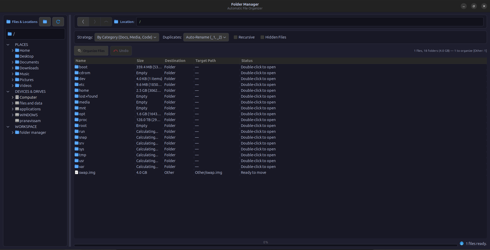

# FOLMAN

Fast, Lightweight Desktop File Manager and Automated Organization Engine.

[](https://github.com/P20000/FOLMAN)
[](https://www.python.org/)
[](https://pygobject.readthedocs.io/)
[](LICENSE)

---



---

## Overview

FOLMAN is a high-performance desktop file manager and automated folder organization utility built for developers, creators, and power users. If your `Downloads/` or workspace folders regularly become disorganized dumping grounds, FOLMAN transforms that chaos into structured, categorized directories in seconds.

Built with Python and native GTK 3 (`PyGObject`), FOLMAN avoids electron-based bloat, running with near-zero resource overhead, fast startup times, and smooth desktop integration.

---

## Key Features

- **Direct Live Preview**: No extra preview clicks required. Navigating to any folder instantly runs a background scan and populates a real-time visual preview of all pending file moves alongside nested subdirectories.
- **Ubuntu-Style Dual-Pane Browser**: Left sidebar organizes standard user Places (Home, Documents, Downloads, Music, Pictures, Videos), mounted Devices and Drives, and expandable workspace folders.
- **Browser-Style History Navigation**: Full Back, Forward, and Up directory traversal with active state tracking.
- **Double-Click Folder Traversal**: Directly inspect and drill down into nested folders within the main preview table.
- **Smart Organization Strategies**:
  - **Category**: Semantic grouping into Documents, Images, Audio, Video, Archives, Code, Data, Executables, and Books.
  - **Extension**: Direct grouping by uppercase file extension (PDF, PNG, PY, ZIP, etc.).
  - **Date**: Chronological archival by modification timestamp (`YYYY-MM`).
- **Progressive Asynchronous Size Calculation**: Directory contents display immediately while folder byte sizes compute in background worker threads, eliminating UI freezes.
- **In-Memory Cache with Modification Validation**: Folder sizes and file counts are cached in memory and automatically invalidated when folder modification timestamps change.
- **Safe Collision Handling**: Choose between automatic incremental renaming (`report_1.pdf`), skipping existing files, or overwriting.
- **One-Click Undo**: Complete rollback capability restoring moved files back to their exact original locations.
- **Dual Interface**: Full-featured graphical interface alongside a scriptable Command Line Interface (CLI).

---

## Architecture & Code Structure

FOLMAN follows a strict modular architecture where core business logic is completely isolated from the user interface. In adherence to project guidelines, every single module is kept compact, focused, and well under a 500-line constraint.

```
FOLMAN/
├── app.py                      # Application entrypoint (GUI launcher & CLI parser)
├── pyproject.toml              # Build system and package metadata
├── AGENTS.md                   # Engineering rules and file length constraints
├── src/
│   └── folder_manager/
│       ├── __init__.py         # Package exports
│       ├── constants.py        # Enums, MIME/extension category mappings
│       ├── models.py           # Dataclasses (SortPlan, FileOperation, SortOptions, SortStats)
│       ├── sorter.py           # Core scanning, planning, execution, and undo engine
│       ├── tree_explorer.py    # Sidebar tree view with lazy filesystem exploration
│       ├── utils.py            # Recursive folder stats, mtime caching, formatting helpers
│       ├── styles.py           # GTK 3 CSS dark theme and design tokens
│       └── ui.py               # Main GTK window, navigation state, async dispatch
└── tests/
    ├── test_basic.py           # Utility initialization tests
    ├── test_sorter.py          # Planning, execution, collision, and undo tests
    ├── test_tree_explorer.py   # Filesystem tree scanning tests
    └── test_utils.py           # Formatting and size cache validation tests
```

### Module Breakdown

- **`src/folder_manager/sorter.py`**: Contains the pure logic engine. Implements `plan_sorting()` to calculate deterministic file move plans without touching the disk, `execute_sorting()` to safely perform file moves with collision handling, and `undo_sorting()` to reverse operations.
- **`src/folder_manager/models.py`**: Implements immutable data transfer objects (`SortPlan`, `FileOperation`, `SortOptions`, `SortStats`) ensuring predictable data flow throughout the application.
- **`src/folder_manager/tree_explorer.py`**: Manages the left navigation sidebar. Loads user home directories, detects mounted drives in `/media` and `/mnt`, and dynamically populates nested child folders on user expansion.
- **`src/folder_manager/utils.py`**: Houses `get_folder_stats()` with built-in recursive caching (`_FOLDER_STATS_CACHE`), human-readable byte formatters, and native GTK icon constructors.
- **`src/folder_manager/styles.py`**: Custom CSS stylesheet providing a modern dark theme, clear visual hierarchy, distinct sidebar sections, and rounded buttons.
- **`src/folder_manager/ui.py`**: Coordinates the GTK 3 window. Dispatches file operations and size calculations to background worker threads, communicating updates back to the UI thread using `GLib.idle_add()`.
- **`app.py`**: The top-level entrypoint that parses CLI flags or starts the GTK event loop.

---

## User Flow & Interaction Lifecycle

```
+-------------------------------------------------------------------------+
|                              USER ACTION                                |
|  - Select a Place / Drive from Sidebar, OR                             |
|  - Double-click a folder in the Preview table, OR                       |
|  - Navigate using Back / Forward / Up buttons                           |
+------------------------------------+------------------------------------+
                                     |
                                     v
+-------------------------------------------------------------------------+
|                           LIVE PREVIEW SCAN                             |
|  1. UI updates path breadcrumb and enables/disables navigation buttons.  |
|  2. Main list immediately populates all subdirectories & files.         |
|  3. Background worker threads scan folder sizes asynchronously.         |
|  4. Core planner generates proposed move targets based on active mode.  |
+------------------------------------+------------------------------------+
                                     |
                                     v
+-------------------------------------------------------------------------+
|                        CONFIGURATION & STRATEGY                         |
|  - Select Mode: Category | Extension | Date                             |
|  - Select Collision Policy: Rename | Skip | Overwrite                   |
|  - Toggle Recursive Subdirectory Scanning                               |
+------------------------------------+------------------------------------+
                                     |
                                     v
+-------------------------------------------------------------------------+
|                           EXECUTION & UNDO                              |
|  - Click "Organize Folder": Moves files, creates target directories,   |
|    and displays real-time progress.                                     |
|  - Click "Undo Last Sort": Reads transaction log and restores every     |
|    file back to its exact original path.                                |
+-------------------------------------------------------------------------+
```

---

## Under The Hood: Performance & Logic Design

### 1. Single-Pass Scanning
Rather than issuing repeated `os.listdir()` and `os.stat()` calls, FOLMAN leverages `os.scandir()` which returns `DirEntry` objects carrying file system attribute caches directly from OS directory streams. This minimizes system calls and delivers instant results even in folders containing thousands of files.

### 2. Progressive Asynchronous Size Calculation
Calculating recursive folder sizes across deep directory trees can easily lock the UI thread. FOLMAN solves this through a progressive background architecture:
- Directory entries are rendered to the GTK `ListStore` immediately with placeholder size indicators (`...`).
- A background worker thread iterates through the entries, calculating sizes using `get_folder_stats()`.
- Thread-safe updates are dispatched to the UI via `GLib.idle_add()`, progressively filling in exact byte counts and file totals without blocking mouse clicks or scrolling.

### 3. Timestamp-Aware In-Memory Caching
To ensure instant back-and-forth folder navigation, folder size computations are cached in a global dictionary keyed by canonical directory path. Each cache lookup validates the directory's `st_mtime_ns`. If the folder was modified since the last check, the cache entry is automatically invalidated and recalculated.

### 4. Deterministic Collision Resolution
When moving a file to a destination where a file with the same name already exists:
- **Rename**: Automatically inserts an incremented counter before the extension (`document_1.pdf`, `document_2.pdf`).
- **Skip**: Leaves the file at its source and increments the skipped counter in `SortStats`.
- **Overwrite**: Replaces the destination file in-place.

---

## Getting Started

### Prerequisites

FOLMAN requires Python 3.8+ and standard GTK 3 libraries.

On Debian / Ubuntu / Pop!_OS:
```bash
sudo apt update
sudo apt install python3 python3-gi python3-gi-cairo gir1.2-gtk-3.0
```

On Fedora / RHEL:
```bash
sudo dnf install python3 python3-gobject gtk3
```

On Arch Linux / Manjaro:
```bash
sudo pacman -S python python-gobject gtk3
```

### Installation

Clone the repository:
```bash
git clone https://github.com/P20000/FOLMAN.git
cd FOLMAN
```

---

## Usage

### 1. Launch the Desktop GUI
```bash
python3 app.py
```

### 2. Command Line Interface (CLI)
You can organize folders directly in automated scripts or terminal sessions:

```bash
# Dry-run preview of planned changes
python3 app.py /path/to/folder --preview

# Organize by semantic Category with auto-renaming
python3 app.py /path/to/folder --mode category --collision rename

# Organize by file Extension recursively
python3 app.py /path/to/folder --mode extension --recursive

# Organize chronologically by modification Date
python3 app.py /path/to/folder --mode date
```

---

## Test Suite

FOLMAN includes a comprehensive unit test suite covering sorting rules, collision resolutions, undo transactions, and cache behavior.

Run the test suite with:
```bash
python3 -m unittest discover -s tests -v
```

All 11 tests run in milliseconds using Python's standard `unittest` framework without requiring third-party testing packages.

---

## License

This project is licensed under the MIT License. See the [LICENSE](LICENSE) file for details.
